## Overview
Measurements of EMG and force were taken in a forearm exercise. The data is divided in two types of muscle activity: intermittent and fatigue. In this Python notebook, we will analyze the intermittent data. The fatigue program has already been explained in a previous notebook (Ch. 5). The recordings to be analyzed can be found in our GitHub repository (https://github.com/emckiernan/electrophys). Before carrying out this analysis practical, students should first do the 'Graphing and exploring EMG data' and 'Filtering and analyzing EMG data' practicals from this series.

## Setting up the notebook

We begin by setting up the Jupyter notebook and importing the Python modules for plotting figures, reading the data and analyzing it.


```python
%pip install pandas;
```

    Requirement already satisfied: pandas in /opt/homebrew/Cellar/jupyterlab/4.4.4/libexec/lib/python3.13/site-packages (2.3.1)
    Requirement already satisfied: numpy>=1.26.0 in /opt/homebrew/lib/python3.13/site-packages (from pandas) (2.2.5)
    Requirement already satisfied: python-dateutil>=2.8.2 in /opt/homebrew/Cellar/jupyterlab/4.4.4/libexec/lib/python3.13/site-packages (from pandas) (2.9.0.post0)
    Requirement already satisfied: pytz>=2020.1 in /opt/homebrew/Cellar/jupyterlab/4.4.4/libexec/lib/python3.13/site-packages (from pandas) (2025.2)
    Requirement already satisfied: tzdata>=2022.7 in /opt/homebrew/Cellar/jupyterlab/4.4.4/libexec/lib/python3.13/site-packages (from pandas) (2025.2)
    Requirement already satisfied: six>=1.5 in /opt/homebrew/Cellar/jupyterlab/4.4.4/libexec/lib/python3.13/site-packages (from python-dateutil>=2.8.2->pandas) (1.17.0)
    Note: you may need to restart the kernel to use updated packages.


```python
import os
import scipy as sc
from scipy import signal
from scipy.optimize import curve_fit
import scipy.io.wavfile
import numpy as np
import matplotlib.pyplot as plt
from numpy.fft import fft, ifft
import wave
import pandas as pd
```


```python
# command to view figures in Jupyter notebook
%matplotlib inline 

# commands to create high-resolution figures with large labels
%config InlineBackend.figure_formats = {'png', 'retina'} 
plt.rcParams['axes.labelsize'] = 14 # fontsize for figure labels
plt.rcParams['font.size'] = 14 # fontsize for figure numbers
```

## Importing data


```python
sr_fatigue_l, fatigue_l = scipy.io.wavfile.read("./data/S1_EMG_leftHand_gripFatigue.wav", "r")
sr_fatigue_r, fatigue_r = scipy.io.wavfile.read("./data/S1_EMG_rightHand_gripFatigue.wav", "r")
```


```python
sr_interm_l,interm_l = scipy.io.wavfile.read("./data/S1_EMG_leftHand_gripIntermittent.wav", "r")
sr_interm_r,interm_r = scipy.io.wavfile.read("./data/S1_EMG_rightHand_gripIntermittent.wav", "r")
```


```python
# Read the csv file of the force recordings
force=pd.read_csv("./data/EMG_Force.csv")
```


```python
f_time=force["Time"].to_numpy()
f_fatigue_l= force["Left_hand_fatigue"].to_numpy()
f_fatigue_l= f_fatigue_l[~np.isnan(f_fatigue_l)]
f_fatigue_r=force["Right_hand_fatigue"].to_numpy()
f_fatigue_r= f_fatigue_r[~np.isnan(f_fatigue_r)]
f_interm_l=force["Left_hand_intermittent"].to_numpy()
f_interm_l=f_interm_l[~np.isnan(f_interm_l)]
f_interm_r=force["Right_hand_intermittent"].to_numpy()
f_interm_r=f_interm_r[~np.isnan(f_interm_r)]
```

## Plotting the data


```python
plt.figure(figsize=(18,6))
plt.title("Force: Fatigue")

plt.plot(np.linspace(0,len(fatigue_r)/sr_fatigue_r,num=len(fatigue_r)),fatigue_r,label="Fatigue R")
plt.plot(np.linspace(0,len(fatigue_l)/sr_fatigue_l,num=len(fatigue_l)),fatigue_l,label="Fatigue L")
plt.legend()
plt.xlabel('Time (s)')
plt.ylabel('Voltage (uncalibrated)')
plt.show;
```


    
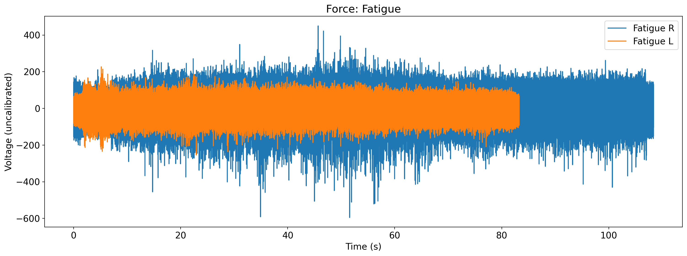
    


```python
plt.figure(figsize=(18,6))
plt.title("Force: Fatigue")
plt.plot(f_time[0:len(f_fatigue_r)],f_fatigue_r,label="Fatigue R")
plt.plot(f_time[0:len(f_fatigue_l)],f_fatigue_l,label="Fatigue L")
plt.legend()
plt.xlabel('Time (s)')
plt.ylabel('Force')
plt.show;
```


    
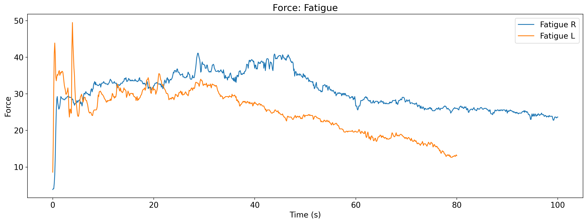
    


```python
plt.figure(figsize=(18,6))
plt.title("EMG: Intermittent")
plt.plot(np.linspace(0,len(interm_l)/sr_interm_l,num=len(interm_l)),interm_l,label="Intermittent L")
plt.plot(np.linspace(0,len(interm_r)/sr_interm_r,num=len(interm_r)),interm_r,label="Intermittent R")
plt.legend()
plt.xlabel('Time (s)')
plt.ylabel('Voltage (uncalibrated)')
plt.show;
```


    
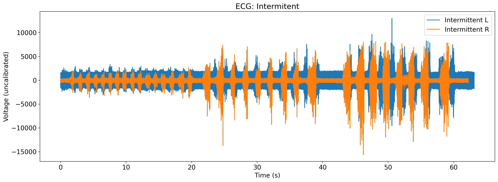
    


```python
plt.figure(figsize=(18,6))
plt.title("Force: Intermittent")
plt.plot(f_time[0:len(f_interm_r)],f_interm_l,label="Intermittent L")
plt.plot(f_time[0:len(f_interm_l)],f_interm_r,label="Intermittent R")
plt.legend()

plt.xlabel('Time (s)')
plt.ylabel('Force (N)')
plt.show;
```


    
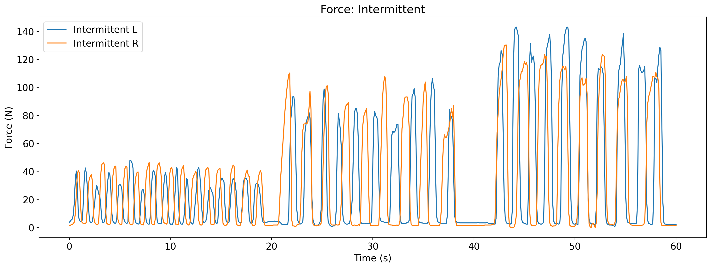
    


## Graphing the intermittent measurements


```python
#The EMG data is larger than the force data. 
# First we need to adjust both arrays.
# The offset is calculated 
offset_i_l=abs(f_time[len(f_interm_l)-1]-len(interm_l)/sr_interm_l)
```


```python
# We establish a delay time.
#Feel free to play with this value until you are certain that both lines coincide
a_i_l=1.58
```


```python
# Plot the left hand intermittent data
plt.figure(figsize=(18,6))
plt.title("Intermittent: Left")
plt.plot(np.linspace(-a_i_l,offset_i_l-a_i_l+f_time[len(f_interm_l-1)],num=len(interm_l)),interm_l,label="EMG")
plt.plot(f_time[0:len(f_interm_l)],max(interm_l)*f_interm_l/max(f_interm_l),label="Force")
#plt.xlim(0,10)
plt.xlabel('Time (s)')
plt.ylabel('Voltage (uncalibrated)')
plt.legend()
plt.show;
```


    
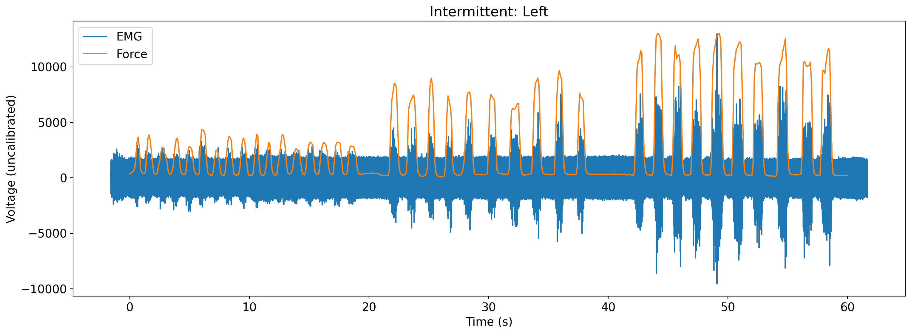
    


```python
# The offset is calculated 
offset_i_r=abs(f_time[len(f_interm_r)-1]-len(interm_r)/sr_interm_r)
```


```python
# We establish a delay time.
#Feel free to play with this value until you are certain that both lines coincide
a_i_r=1
```


```python
# Plot the left hand intermittent data
plt.figure(figsize=(18,6))
plt.title("Intermittent: Right")
plt.plot(np.linspace(-0.9,offset_i_r-a_i_r+f_time[len(f_interm_r-1)],num=len(interm_r)),interm_r,label="EMG")
plt.plot(f_time[0:len(f_interm_r)],max(interm_r)*f_interm_r/max(f_interm_r),label="Force")
#plt.xlim(0,10)
plt.xlabel('Time (s)')
plt.ylabel('Voltage (uncalibrated)')
plt.legend()
plt.show;
```


    
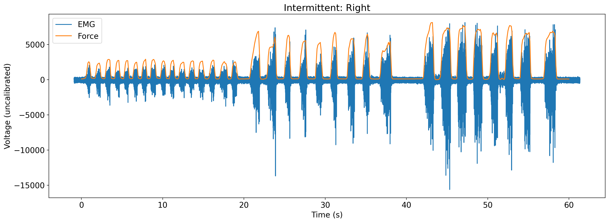
    


## Graphing the fatigue measurments


```python
# The offset is calculated 
offset_f_l=abs(f_time[len(f_fatigue_l-1)]-len(fatigue_l)/sr_fatigue_l)
```


```python
# We establish a delay time.
#Feel free to play with this value until you are certain that both lines coincide
a_f_l=1.15
```


```python
# Plot the left hand fatigue data
plt.figure(figsize=(18,6))
plt.title("Fatigue: Left")
plt.plot(np.linspace(-a_f_l,offset_f_l-a_f_l+f_time[len(f_fatigue_l)-1],num=len(fatigue_l)),fatigue_l,label="EMG")
plt.plot(f_time[0:len(f_fatigue_l)],max(fatigue_l)*f_fatigue_l/max(f_fatigue_l),label="Force")
plt.legend()
#plt.xlim(0,10)
plt.xlabel('Time (s)')
plt.ylabel('Voltage (uncalibrated)')
plt.show;
```


    
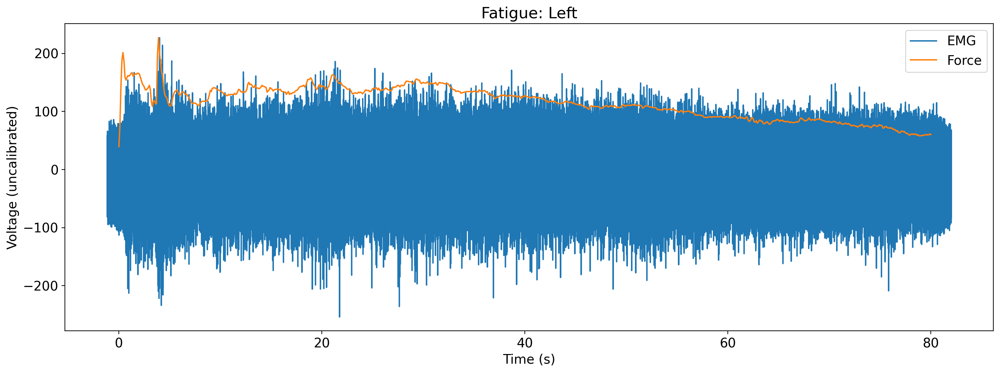
    


```python
# The offset is calculated 
offset_f_r=abs(f_time[len(f_fatigue_r)-1]-len(fatigue_r)/sr_fatigue_r)
```


```python
# We establish a delay time.
#Feel free to play with this value until you are certain that both lines coincide
a_f_r=6.3
```


```python
# Plot the right hand fatigue data
plt.figure(figsize=(18,6))
plt.title("Fatigue: Right")
plt.plot(np.linspace(-a_f_r,offset_f_r-a_f_r+f_time[len(f_fatigue_r)-1],num=len(fatigue_r)),fatigue_r,label="EMG")
plt.plot(f_time[0:len(f_fatigue_r)],6*f_fatigue_r,label="Force")
plt.xlabel('Time (s)')
plt.ylabel('Voltage (uncalibrated)')
plt.legend()
#plt.xlim(0,10)
plt.show;
```


    
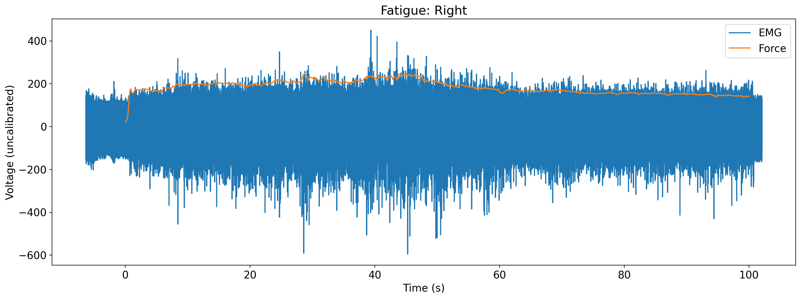
    


## Filtering the signals


```python
# Function to delete the 60Hz noise from a given signal
def filtering(x,sr):
    X=fft(x)

    # calculate the frequency
    N = len(X)
    n = np.arange(N)
    T = N/sr
    freq = n/T 
    
    # Get the one-sided specturm
    n_oneside = N//2
    # get the one side frequency
    f_oneside = freq[:n_oneside]

    # normalize the amplitude
    X_oneside =X[:n_oneside]/n_oneside
    
    # Filter out the 60 Hz noise
    for i in range(int(55*T),int(65*T)+1):
        X[i]=0
        X[-i-1]=0
    X2=ifft(X).real
    return X2
    #plt.figure(figsize=(18,6))
    #plt.plot(np.linspace(0,T,num=N),X2)
    #plt.stem(f_oneside, abs(X_oneside), linefmt='b',markerfmt=" ", basefmt="-b")
    #plt.xlabel('Freq (Hz)')
    #plt.ylabel('Normalized FFT Amplitude |X(freq)|')
    #plt.xlim(10,400)
    #plt.show()
```


```python
interm_l=filtering(interm_l,sr_interm_l)
```


```python
interm_r=filtering(interm_r,sr_interm_r)
```


```python
fatigue_l=filtering(fatigue_l,sr_fatigue_l)
```


```python
fatigue_r=filtering(fatigue_r,sr_fatigue_r)
```

## Finding the activation limits in the intermittent signal

### First derivative function

One way to find the beginning and ending of the signal is by analyzing concavities. To do this we must first find the first derivative of the function.


```python
#Function to find the first derivative
def der1(array):
    r=[0]
    for i in range(1,len(array)):
        r.append(array[i]-array[i-1])
    return(r)
```


```python
plt.figure(figsize=(18,6))
plt.title("Force: Intermittent")
plt.plot(f_time[0:len(f_interm_l)],f_interm_l,label="Intermittent L")
plt.legend()
plt.xlabel('Time (s)')
plt.ylabel('Force (N)')
plt.show;
```


    
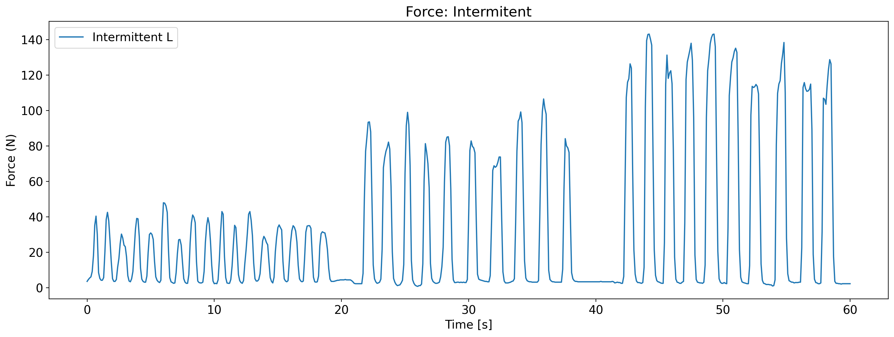
    


Now we compute the first derivative to the array graphed above.


```python
f_interm_l_prime=der1(f_interm_l)
```


```python
plt.figure(figsize=(18,6))
plt.title("Force: Intermittent Left")
plt.plot(f_time[:len(f_interm_l)],f_interm_l,label="Intermittent L")
plt.plot(f_time[:len(f_interm_l)],f_interm_l_prime,label="Intermittent L'")
plt.legend()
plt.xlabel('Time (s)')
plt.ylabel('Force (N)')
plt.show;
```


    
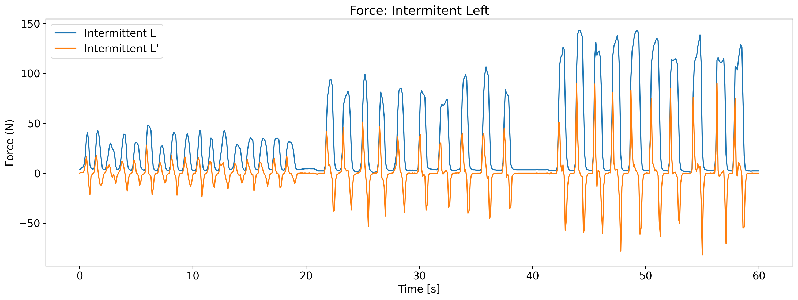
    


### Second derivative function

Now we compute the second derivative


```python
f_interm_l_2prime=der1(f_interm_l_prime)
```


```python
plt.figure(figsize=(18,6))
plt.title("Force: Intermittent Left")
plt.plot(f_time[:len(f_interm_l)],f_interm_l,label="Intermittent L")
plt.plot(f_time[:len(f_interm_l)],f_interm_l_2prime,label="Intermittent L''")
plt.legend()
plt.xlabel('Time (s)')
plt.ylabel('Force (N)')
plt.show;
```


    
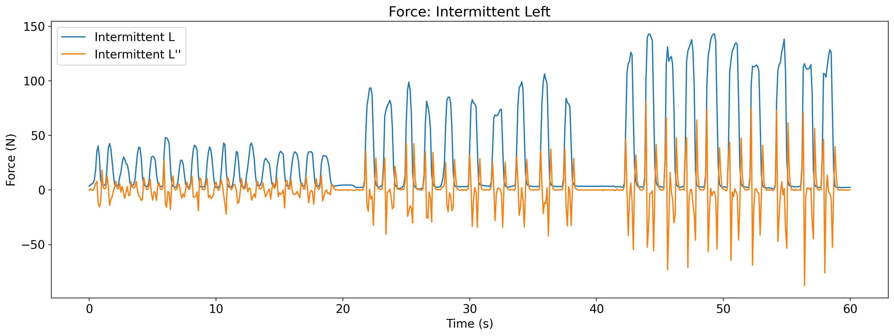
    


Notice how we only care about the peaks, so we will compute them in the next section.

### Inflection points


```python
def local_max(x,y):
    r=[[],[]]
    for i in range(1,len(y)-1):
        if y[i]>y[i-1]:
            if y[i]>y[i+1]:
                r[0].append(x[i])
                r[1].append(y[i])
    return r
```


```python
f_interm_l_ip=local_max(f_time[:len(f_interm_l)],f_interm_l_prime)
```


```python
plt.figure(figsize=(18,6))
plt.title("Force: Intermittent Left")
plt.plot(f_time[:len(f_interm_l)],f_interm_l,label="Intermittent L")
plt.plot(f_time[:len(f_interm_l)],f_interm_l_prime,label="Intermittent L'")
plt.scatter(f_interm_l_ip[0],f_interm_l_ip[1],label="Inflection points")
plt.legend()
plt.xlabel('Time (s)')
plt.ylabel('Force (N)')
plt.show;
```


    
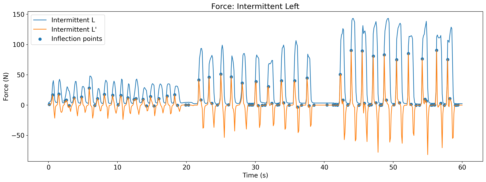
    


Notice that we have too many inflection points that occur due to noise, so we will filter out all the points that are above zero. 


```python
def local_max(x,y):
    r=[[],[]]
    for i in range(1,len(y)-1):
        if y[i]>7.5:
            if y[i]>y[i-1]:
                if y[i]>y[i+1]:
                    r[0].append(x[i])
                    r[1].append(y[i])
    return r
```


```python
f_interm_l_ip=local_max(f_time[:len(f_interm_l)],f_interm_l_prime)
```


```python
plt.figure(figsize=(18,6))
plt.title("Force: Intermittent Left")
plt.plot(f_time[:len(f_interm_l)],f_interm_l,label="Intermittent L")
plt.plot(f_time[:len(f_interm_l)],f_interm_l_prime,label="Intermittent L'")
plt.scatter(f_interm_l_ip[0],f_interm_l_ip[1],label="Inflection points")
plt.xlim(0,20)
plt.ylim(0,50)
plt.grid()
plt.xlabel('Time (s)')
plt.ylabel('Force (N)')
plt.legend()
plt.show;
```


    
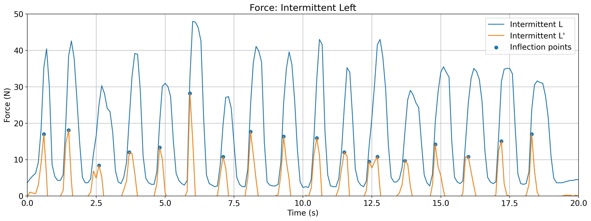
    


### Limits with threshold:


```python
def pa_beginning(x,y,threshold=5):
    r=[[],[],[]]
    for i in range(0,len(y)-1):
        if y[i+1]>threshold:
            if y[i]<threshold:
                r[0].append(x[i])
                r[1].append(y[i])
                r[2].append(i)
    return(r)
```


```python
f_interm_l_pab=pa_beginning(f_time,f_interm_l_prime,threshold=4)
```


```python
plt.figure(figsize=(18,6))
plt.title("Force: Intermittent Left")
plt.plot(f_time[:601],f_interm_l,label="Intermittent L")
plt.plot(f_time[:601],f_interm_l_prime,label="Intermittent L'")
plt.scatter(f_interm_l_pab[0],f_interm_l_pab[1],label="Inflection points")
plt.xlim(0,20)
plt.ylim(0,50)
plt.grid()
plt.xlabel('Time (s)')
plt.ylabel('Force (N)')
plt.legend()
plt.show;
```


    
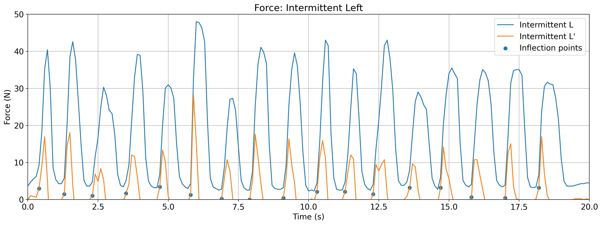
    


```python
def pa_ending(x,y,threshold=-5):
    r=[[],[],[]]
    for i in range(0,len(y)-1):
        if y[i+1]>threshold:
            if y[i]<threshold:
                r[0].append(x[i+1])
                r[1].append(y[i+1])
                r[2].append(i+1)
    return(r)
```


```python
f_interm_l_pae=pa_ending(f_time,f_interm_l_prime,threshold=-6)
```


```python
plt.figure(figsize=(18,6))
plt.title("Force: Intermittent Left")
plt.plot(f_time[0:601],f_interm_l,label="Intermittent L")
plt.plot(f_time[0:601],f_interm_l_prime,label="Intermittent L'")

plt.scatter(f_interm_l_pab[0],f_interm_l_pab[1],label="Start")
plt.scatter(f_interm_l_pae[0],f_interm_l_pae[1],label="End")
plt.xlim(0,20)
plt.ylim(-8,20)
plt.grid()
plt.xlabel('Time (s)')
plt.ylabel('Force (N)')
plt.legend()
plt.show;
```


    
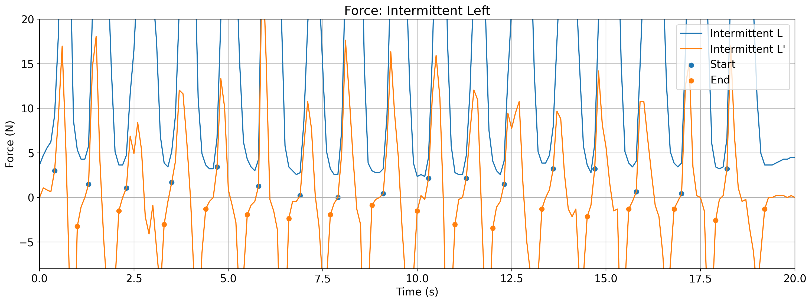
    


```python
def segments_th(x,y,threshold=6):
    r=[[[],[],[]],[[],[],[]]]
    start=False
    for i in range(1,len(y)):
        if start==False:
            if y[i]>threshold:
                if y[i-1]<threshold:
                    r[0][0].append(x[i])
                    r[0][1].append(y[i])
                    r[0][2].append(i)
                    start=True
        if start==True:
            if y[i]<threshold:
                if y[i-1]>threshold:
                    r[1][0].append(x[i-1])
                    r[1][1].append(y[i-1])
                    r[1][2].append(i-1)
                    start=False
    return(r)
```


```python
segments_l=segments_th(f_time[:601],f_interm_l)
segments_r=segments_th(f_time[:len(f_interm_r)],f_interm_r)
```


```python
plt.figure(figsize=(18,6))
plt.title("Force: Intermittent Left")
plt.plot(f_time[:601],f_interm_l,label="Intermittent L")
plt.scatter(segments_l[0][0],segments_l[0][1],label="Start")
plt.scatter(segments_l[1][0],segments_l[1][1],label="End")
#plt.xlim(0,20)
plt.xlabel('Time (s)')
plt.ylabel('Force (N)')
plt.grid()
plt.legend()
plt.show;
```


    
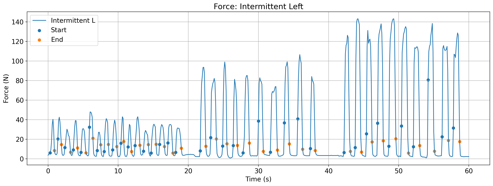
    


```python
plt.figure(figsize=(18,6))
plt.title("Force: Intermittent Right")
plt.plot(f_time[:len(f_interm_r)],f_interm_r,label="Intermittent R")
plt.scatter(segments_r[0][0],segments_r[0][1],label="Start")
plt.scatter(segments_r[1][0],segments_r[1][1],label="End")
#plt.xlim(0,20)
plt.grid()
plt.xlabel('Time (s)')
plt.ylabel('Force (N)')
plt.legend()
plt.show;
```


    
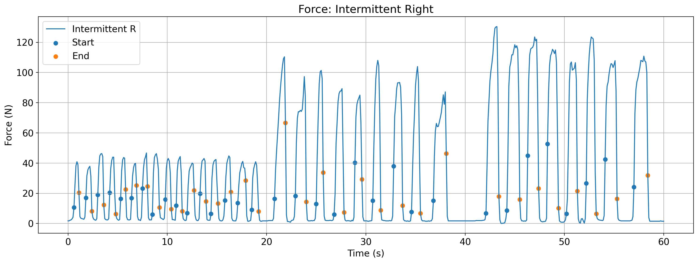
    


## Segmenting the EMG


```python
def find_in(array,x):
    for i in range(1,len(array)):
        if array[i]>=x:
            if array[i-1]<x:
                return(i)
    print("Error: Value not found")
    return("Error")
```


```python
Time_a=np.linspace(-1.45,offset_i_l-a_i_l+f_time[len(f_interm_l-1)],num=len(interm_l))
Time_b=np.linspace(-0.9,offset_i_r-a_i_r+f_time[len(f_interm_r-1)],num=len(interm_r))
```


```python
plt.figure(figsize=(18,6))
plt.title("Intermittent: Left")
plt.plot(Time_a,interm_l,label="EMG")
plt.plot(f_time[:601],max(interm_l)*f_interm_l/max(f_interm_l),label="Force")
#plt.scatter(segments[0][0],100*segments[0][1],label="Start")
#plt.scatter(segments[1][0],100*segments[1][1],label="End")
plt.xlim(0,10)
plt.ylim(-5000,5000)
plt.xlabel('Time (s)')
plt.ylabel('Force (N)')
plt.legend()
plt.show;
```


    
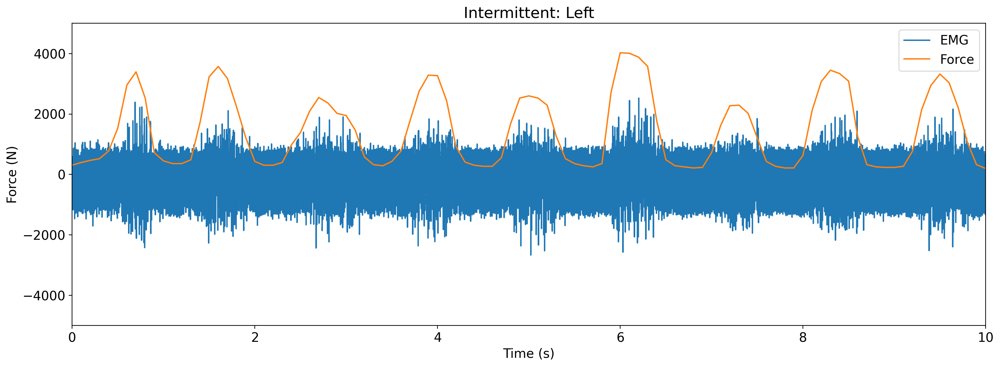
    


```python
plt.figure(figsize=(18,6))
plt.title("Intermittent: Right")
plt.plot(Time_b,interm_r,label="EMG")
plt.plot(f_time[:len(f_interm_r)],max(interm_r)*f_interm_r/max(f_interm_r),label="Force")
#plt.scatter(segments[0][0],100*segments[0][1],label="Start")
#plt.scatter(segments[1][0],100*segments[1][1],label="End")
plt.xlim(0,10)
plt.ylim(-5000,5000)
plt.xlabel('Time (s)')
plt.ylabel('Force (N)')
plt.legend()
plt.show;
```


    
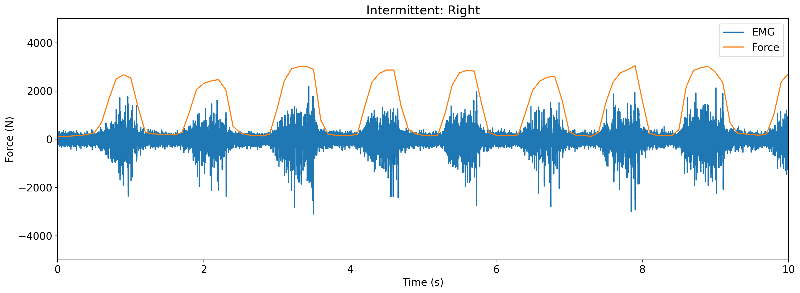
    


## Muscle fiber recruitment: Frequency analysis

### Main frequency comparison
The first value we are going to look into is the main frequency of each segment. This might give us a clue of the amount of muscle fibers that are getting activated. We expect to find higher frequencies when the force is greater, though the correlation is not always perfect. 


```python
#First we define a function that calculates the fft of a given segment 
# and returns the frequency at which a maxima is obtained
def mainFreq(i,side="l"):
    if side=="l":
        Pa=interm_l[find_in(Time_a,segments_l[0][0][i]):find_in(Time_a,segments_l[1][0][i])]
        #plt.figure(figsize=(18,6))
        #plt.subplot(121)
        #plt.plot(Time_a[find_in(Time_a,segments_l[0][0][i]):find_in(Time_a,segments_l[1][0][i])],Pa)
        #plt.xlabel("Time(s)")
        #plt.ylabel("EMG Amplitude (uV)")
        #plt.title("EMG")
    else:
        Pa=interm_r[find_in(Time_b,segments_r[0][0][i]):find_in(Time_b,segments_r[1][0][i])]
        #plt.figure(figsize=(18,6))
        #plt.subplot(121)
        #plt.plot(Time_b[find_in(Time_b,segments_r[0][0][i]):find_in(Time_b,segments_r[1][0][i])],Pa)
        #plt.xlabel("Time(s)")
        #plt.ylabel("EMG Amplitude (uV)")
        #plt.title("EMG")
    
    #The fft is calculated
    X = fft(Pa)
    N = len(X)
    n = np.arange(N)
    freq = n/(Time_a[-1]-Time_a[0])

    # Get the one-sided specturm
    n_oneside = N//2
    # get the one side frequency
    f_oneside = freq[:n_oneside]

    # normalize the amplitude
    X_oneside =X[:n_oneside]/n_oneside

    main_freq=freq[np.argmax(X_oneside)]

    #plt.subplot(122)
    #plt.stem(f_oneside, abs(X_oneside), linefmt='b',markerfmt=" ", basefmt="-b")
    #plt.xlabel('Freq (Hz)')
    #plt.ylabel('Normalized FFT Amplitude |X(freq)|')
    #plt.tight_layout()
    #plt.xlim(0,100)
    #plt.show()
    return(main_freq)
```


```python
np.shape(segments_r)
```


    (2, 3, 33)


```python
freq_req_l=[]
for i in range(0,37):
    freq_req_l.append(mainFreq(i))
```


```python
freq_req_r=[]
for i in range(0,33):
    freq_req_r.append(mainFreq(i,side="r"))
```

Each segment is classified by the intensity of the force produced. Each of the 4 measurments consisted in 3 sets of pulses (S1, S2 and S3). The force produced was meant to be similar in every pulse of a given set. The first set (s1) corresponds to the lowest force pulses, while the third and last set (S3) corresponds to the higher force pulses.


```python
plt.figure(figsize=(18,6))
plt.scatter(np.linspace(0,60,num=37)[:17],freq_req_l[:17],label="S1")
plt.scatter(np.linspace(0,60,num=37)[17:27],freq_req_l[17:27],label="S2")
plt.scatter(np.linspace(0,60,num=37)[27:],freq_req_l[27:],label="S3")
plt.legend()
plt.title('Analysis: Left')
plt.ylabel('Main Frequency (Hz)')
plt.xlabel('Time (s)')
plt.show;
```


    
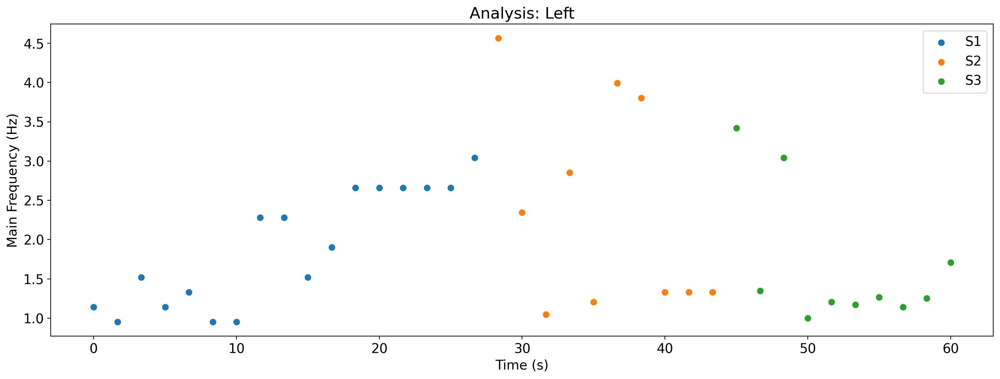
    


```python
plt.figure(figsize=(18,6))
plt.scatter(np.linspace(0,60,num=33)[:16],freq_req_r[:16],label="S1")
plt.scatter(np.linspace(0,60,num=33)[16:25],freq_req_r[16:25],label="S2")
plt.scatter(np.linspace(0,60,num=33)[25:],freq_req_r[25:],label="S3")
plt.legend()
plt.title('Analysis: Right')
plt.ylabel('Main Frequency (Hz)')
plt.xlabel('Time (s)')
plt.show;
```


    
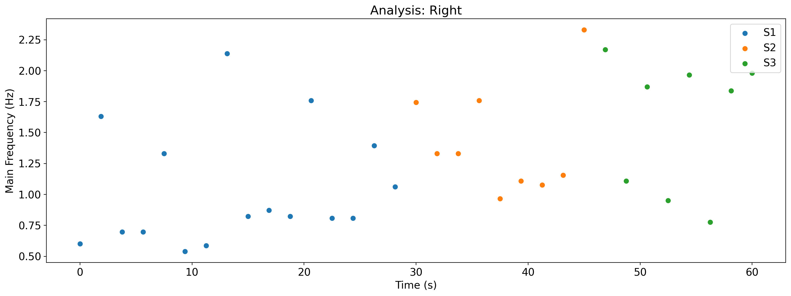
    


From the graphs above we can concude that the most relevant frequency isn't a significant number. No strong correlation can be found between the force produced and the frequency of the EMG based on this analysis. This might be due to two reasons. Either the measurements do not have enough resolution to properly indentify the muscle fiber recruitment, or the shape of the spectrogram cannot be accurately described by the main frequency component. In the first case we would need to repeat the experiment again and get new measurements with a more precise detector. If the second case is true, we should find a new way to clasify the shape of the spectrogram. 

### Spectrogram


```python
f_r,t_r,sxx_r = sc.signal.spectrogram(interm_r,sr_interm_r,nperseg=sr_interm_r//2, scaling='spectrum')
```


```python
f_l,t_l,sxx_l = sc.signal.spectrogram(interm_l,sr_interm_l,nperseg=sr_interm_l//2, scaling='spectrum')
```


```python
f_r = f_r[:401]
sxx_r = sxx_r[:401]

fig = plt.figure(figsize=(30,15),dpi=50)
ax1 = plt.subplot(211)
plt.pcolormesh(np.log(sxx_r),cmap='jet')
plt.xticks([])
plt.ylabel('Frequency (Hz)')
plt.title('Spectrogram - Rectified EMG')

ax2 = plt.subplot(212)
plt.plot(np.arange(0,len(interm_r))/sr_interm_r,interm_r,lw=.1)
plt.ylabel('Voltage (uncalibrated)')
plt.xlabel('Time (sec)')
plt.xlim(t_r[0],t_r[-1])

# adding an independent axis for the colorbar:
fig.subplots_adjust(right=0.8)
cbar_ax = fig.add_axes([.81, .5, 0.025, 0.4])
plt.colorbar(label='log($Voltage^2$)',cax=cbar_ax,)

plt.draw()
```


    
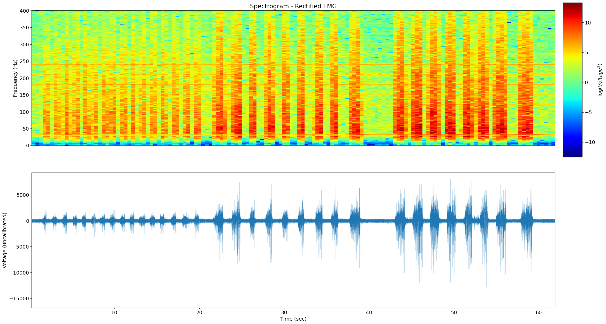
    


```python
f_l = f_l[:401]
sxx_l = sxx_l[:401]

fig = plt.figure(figsize=(30,15),dpi=50)
ax1 = plt.subplot(211)
plt.pcolormesh(np.log(sxx_l),cmap='jet')
plt.xticks([])
plt.ylabel('Frequency (Hz)')
plt.title('Spectrogram - Rectified EMG')

ax2 = plt.subplot(212)
plt.plot(np.arange(0,len(interm_l))/sr_interm_l,interm_l,lw=.1)
plt.ylabel('Voltage (uncalibrated')
plt.xlabel('Time (s)')
plt.xlim(t_l[0],t_l[-1])

# adding an independent axis for the colorbar:
fig.subplots_adjust(right=0.8)
cbar_ax = fig.add_axes([.81, .5, 0.025, 0.4])
plt.colorbar(label='log($Voltage^2$)',cax=cbar_ax,)

plt.draw()
```


    
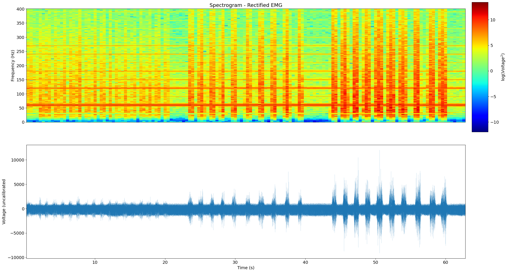
    


From the spectrogram we can see that the main frequency isn't as important as the distribution of the spectrogram. In pulses of greater force, the spectogram of the signal apears to be wider (more high frequency components). From these observations we see that the signal could be described by the mean root squared of the values in the corresponding segment. 

### Average frequency in spectrogram of each segment


```python
def rms_freq(i,side="l"):
    if side=="l":
        Pa=interm_l[find_in(Time_a,segments_l[0][0][i]):find_in(Time_a,segments_l[1][0][i])]
    else:
        Pa=interm_r[find_in(Time_b,segments_r[0][0][i]):find_in(Time_b,segments_r[1][0][i])]
    
    #The fft is calculated
    X = fft(Pa)
    N = len(X)
    n = np.arange(N)
    freq = n/(Time_a[-1]-Time_a[0])

    # Get the one-sided spectrum
    n_oneside = N//2
    # get the one side frequency
    f_oneside = freq[:n_oneside]

    # normalize the amplitude
    X_oneside =X[:n_oneside]/n_oneside
    
    #First we compute the area under the curve of the spectrogram in log scale
    area=0.
    for i in range(0,n_oneside):
        area+=np.log(abs(X_oneside[i]))
    
    #Now we must find the value i at which the area under the curve is the half of the total area
    area2=0.
    for i in range(0,n_oneside):
        if area2>(area/2):
            area2+=np.log(abs(X_oneside[i]))
        else:
            return freq[i]
```


```python
freq_rms_l=[]
for i in range(0,37):
    freq_rms_l.append(rms_freq(i))
```


```python
plt.figure(figsize=(18,6))
plt.scatter(np.linspace(0,60,num=37)[:17],freq_rms_l[:17],label="S1")
plt.scatter(np.linspace(0,60,num=37)[17:27],freq_rms_l[17:27],label="S2")
plt.scatter(np.linspace(0,60,num=37)[27:],freq_rms_l[27:],label="S3")
plt.legend()
plt.title('Analysis: Left')
plt.ylabel('Average Frequency (Hz)')
plt.xlabel('Time (s)')
plt.show;
```


    
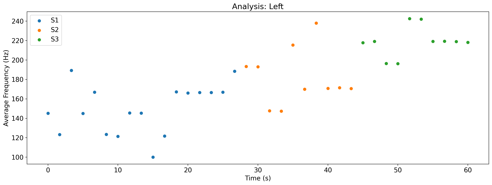
    


```python
freq_rms_r=[]
for i in range(0,33):
    freq_rms_r.append(rms_freq(i,side="r"))
```


```python
plt.figure(figsize=(18,6))
plt.scatter(np.linspace(0,60,num=33)[:16],freq_rms_r[:16],label="S1")
plt.scatter(np.linspace(0,60,num=33)[16:25],freq_rms_r[16:25],label="S2")
plt.scatter(np.linspace(0,60,num=33)[25:],freq_rms_r[25:],label="S3")
plt.legend()
plt.title('Analysis: right')
plt.ylabel('Average Frequency (Hz)')
plt.xlabel('Time (s)')
plt.show;
```


    
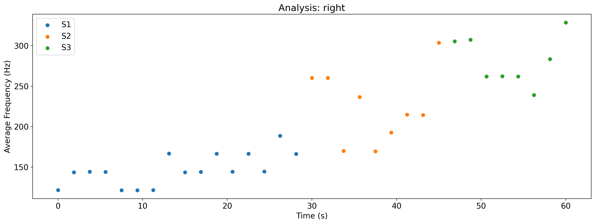
    


## Average frequency vs force produced


```python
# For every segment of the force array, we append the maximum value to the array f_interm_l_max
f_interm_l_max=[]
for i in range(0,len(segments_l[0][0])):
    f_interm_l_max.append(max(f_interm_l[segments_l[0][2][i]:segments_l[1][2][i]]))
```


```python
len(f_interm_l_max)
```


    37


```python
# For every segment of the force array, we append the maximum value to the array f_interm_r_max
f_interm_r_max=[]
for i in range(0,len(segments_r[0][0])):
    f_interm_r_max.append(max(f_interm_r[segments_r[0][2][i]:segments_r[1][2][i]]))
```


```python
plt.figure(figsize=(18,6))
plt.scatter(f_interm_l_max[:17],freq_rms_l[:17],label="S1")
plt.scatter(f_interm_l_max[17:27],freq_rms_l[17:27],label="S2")
plt.scatter(f_interm_l_max[27:],freq_rms_l[27:],label="S3")
plt.legend()
plt.title('Analysis: Left')
plt.ylabel('Average Frequency (Hz)')
plt.xlabel("Force max (N)")
plt.show;
```


    
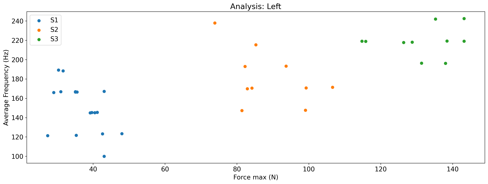
    


```python
plt.figure(figsize=(18,6))
plt.scatter(f_interm_r_max[:16],freq_rms_r[:16],label="S1")
plt.scatter(f_interm_r_max[16:25],freq_rms_r[16:25],label="S2")
plt.scatter(f_interm_r_max[25:],freq_rms_r[25:],label="S3")
plt.legend()
plt.title('Analysis: Right')
plt.ylabel('Average Frequency (Hz)')
plt.xlabel("Force max (N)")
plt.show;
```


    
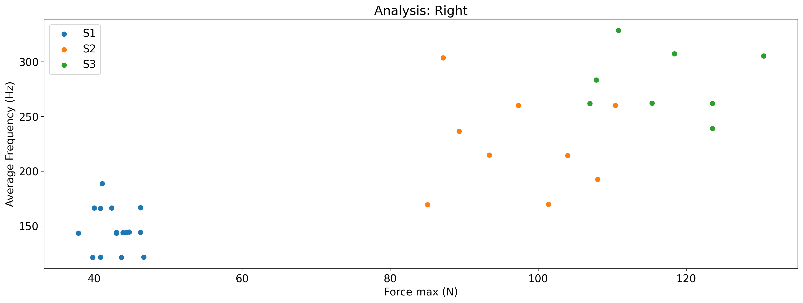
    


## Rectification and envelope

### Envelope method 1: Low-pass filter


```python
interm_r_abs=abs(interm_r)
interm_l_abs=abs(interm_l)
```


```python
def envelope(x,sr,lf=15):
    X=fft(x)

    # calculate the frequency
    N = len(X)
    T = N/sr
    
    # Filter out the 60 Hz noise
    for i in range(int(lf*T),len(X)-int(lf*T)):
        X[i]=0
    X2=ifft(X).real
    return X2
```


```python
interm_l_env=envelope(interm_l_abs,sr_interm_l)
interm_r_env=envelope(interm_r_abs,sr_interm_r)
```


```python
plt.figure(figsize=(18,6))
plt.plot(Time_a,interm_l_abs,label="Rectified signal")
plt.plot(Time_a,interm_l_env,label="Envelope")
plt.legend()
plt.title("Envelope: Low-pass filter (Left)")
plt.xlabel("Time (s)")
plt.ylabel('Voltage (uncalibrated)')
plt.show()
```


    
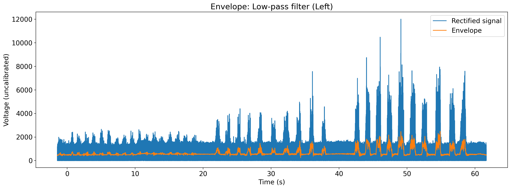
    


```python
plt.figure(figsize=(18,6))
plt.plot(Time_b,interm_r_abs,label="Rectified signal")
plt.plot(Time_b,interm_r_env,label="Envelope")
plt.legend()
plt.title("Envelope: Low-pass filter (right)")
plt.xlabel("Time (s)")
plt.ylabel('Voltage (uncalibrated)')
plt.show()
```


    
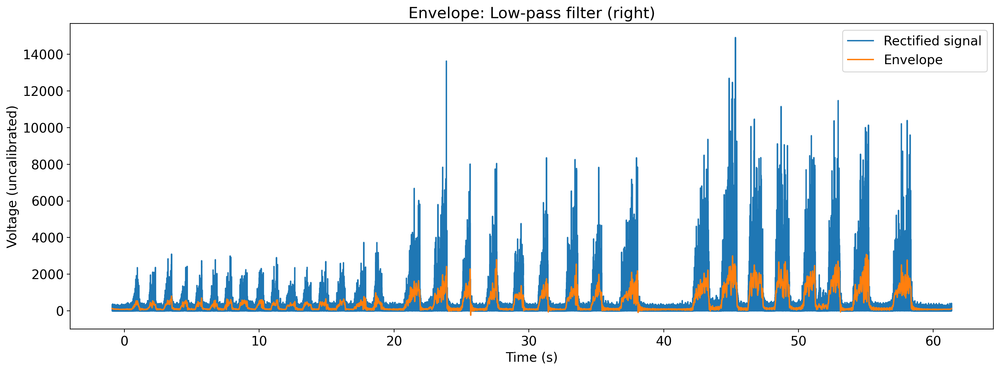
    


### Envelope method 2: Local max in a time window


```python
def envelope_2(x,y,s=6000):
    # x: Time array
    # y: Voltage array
    # s: Time window (# of values in a single time window)
    x2=[]
    y2=[]
    for i in range(0,-1+len(x)//s):
        x2.append(max(x[s*i:s*(i+1)]))
        y2.append(y[s*i])
    return(x2,y2)
```


```python
#The envelope is calculated for each hand
interm_l_env2,time_l_env=envelope_2(interm_l_abs,Time_a)
interm_r_env2,time_r_env=envelope_2(interm_r_abs,Time_b)
```


```python
#Plot left hand envelope and EMG
plt.figure(figsize=(18,6))
plt.plot(time_l_env,interm_l_env2,label="Envelope")
plt.plot(Time_a,interm_l,label="EMG")
plt.legend()
#plt.xlim(0,10)
plt.title("Envelope: Local maxima (left)")
plt.xlabel("Time (s)")
plt.ylabel('Voltage (uncalibrated)')
plt.show()
```


    
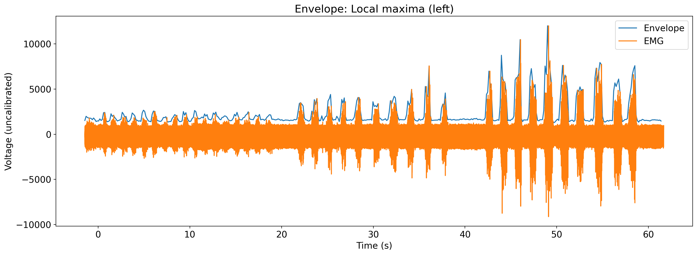
    


```python
#Plot right hand envelope and EMG
plt.figure(figsize=(18,6))
plt.plot(time_r_env,interm_r_env2,label="Envelope")
plt.plot(Time_b,interm_r,label="EMG")
plt.legend()
plt.title("Envelope: Local maxima (right)")
plt.xlabel("Time (s)")
plt.ylabel('Voltage (uncalibrated)')
plt.show()
```


    
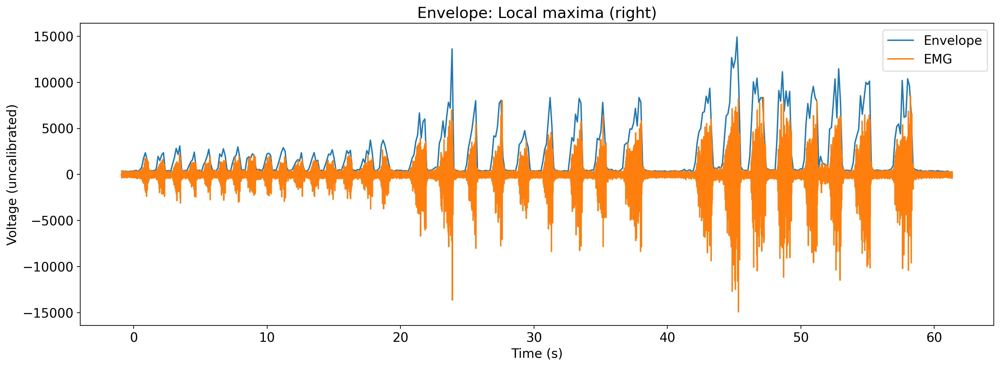
    


### Envelope method 3: Root mean squared in a time window


```python
def envelope_rms(x,s=3000):
    x2 = np.power(x,2)
    window = np.ones(s)/float(s)
    return np.sqrt(np.convolve(x2, window, 'same'))
```

Breaking it down, the np.power(a, 2) part makes a new array with the same dimension as a, but where each value is squared. np.ones(window_size)/float(window_size) produces an array or length window_size where each element is 1/window_size.


```python
interm_l_rms=envelope_rms(interm_l_abs)
interm_r_rms=envelope_rms(interm_r_abs)
```


```python
#Plot left hand envelope and EMG
plt.figure(figsize=(18,6))
plt.plot(Time_a,interm_l_abs,label="Rectified signal")
plt.plot(Time_a,3*interm_l_rms,label="Envelope")
plt.legend()
#plt.xlim(0,10)
plt.title("Envelope: Local maxima (left)")
plt.xlabel("Time (s)")
plt.ylabel('Voltage (uncalibrated)')
plt.show()
```


    
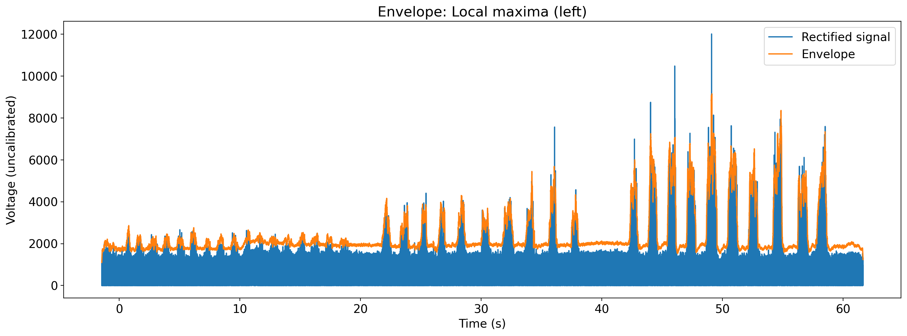
    


```python
#Plot left hand envelope and EMG
plt.figure(figsize=(18,6))
plt.plot(Time_b,interm_r_abs,label="Rectified signal")
plt.plot(Time_b,3*interm_r_rms,label="Envelope")
plt.legend()
#plt.xlim(0,10)
plt.title("Envelope: Local maxima (left)")
plt.xlabel("Time (s)")
plt.ylabel('Voltage (uncalibrated)')
plt.show()
```


    
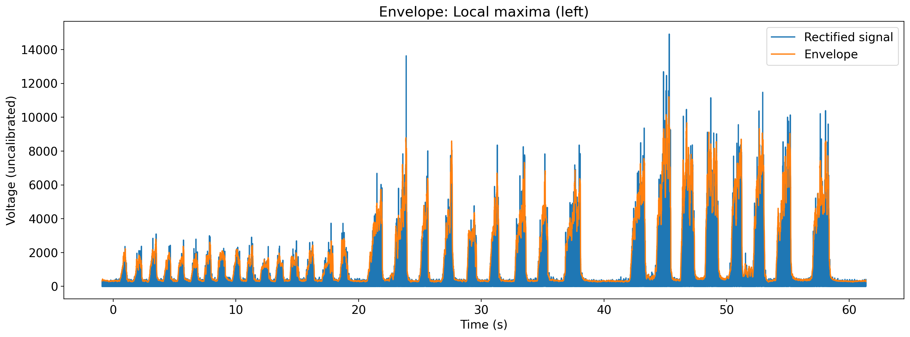
    


## Enveloped EMG signal vs Force signal


```python
# Plot enveloped EMG and the Force signal
plt.figure(figsize=(18,6))
plt.plot(Time_a,5*interm_l_rms,label="Envelope")
plt.plot(f_time[:len(f_interm_l)],max(interm_l)*f_interm_l/max(f_interm_l),label="Force(scaled)")
plt.legend()
plt.title("Envelope vs Force (left)")
plt.xlabel("Time (s)")
plt.ylabel('Voltage (uncalibrated)')
#plt.xlim(0,10)
plt.show()
```


    
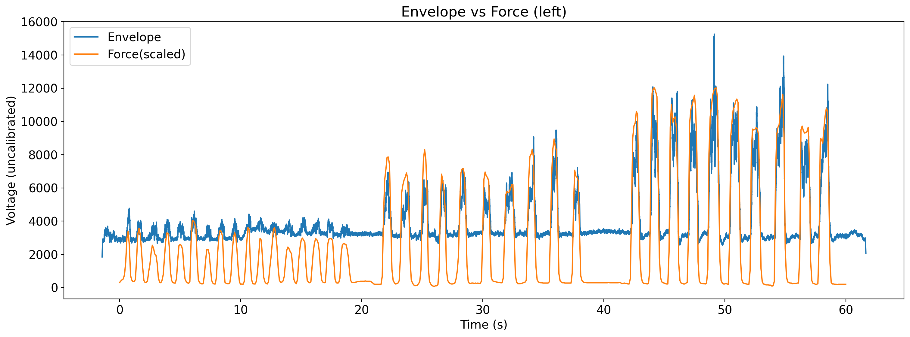
    


```python
plt.figure(figsize=(18,6))
plt.plot(Time_b,5*interm_r_rms,label="Envelope")
plt.plot(f_time[:len(f_interm_r)],max(interm_r_env2)*f_interm_r/max(f_interm_r),label="Force")
plt.legend()
#plt.xlim(50,60)
plt.title("Envelope vs Force (right)")
plt.xlabel("Time (s)")
plt.ylabel('Voltage (uncalibrated)')
plt.show()
```


    
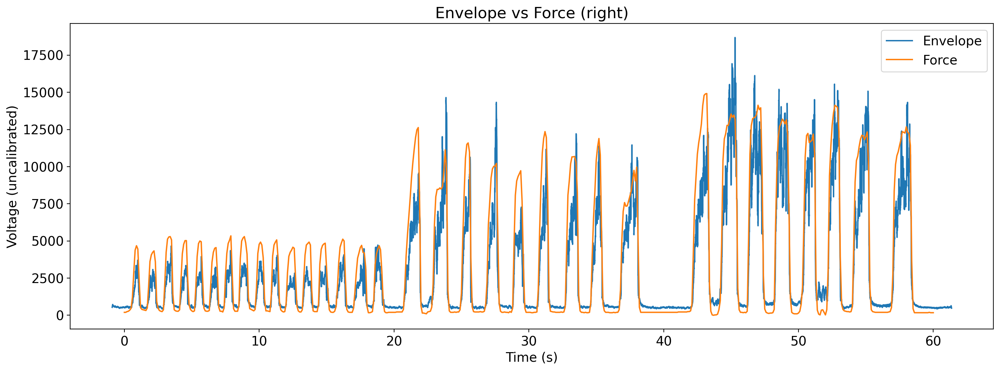
    


## Base line compensation


```python
baseLine_l=min(interm_l_rms[6000:len(interm_l_rms)-6000])
```


```python
plt.figure(figsize=(18,6))
plt.plot(Time_a,5*(interm_l_rms-baseLine_l),label="Envelope")
plt.plot(f_time[:len(f_interm_l)],max(interm_l_env2-baseLine_l)*f_interm_l/max(f_interm_l),label="Force")
plt.legend()
#plt.xlim(20,30)
plt.title("Envelope vs Force with baseline compensation (left)")
plt.xlabel("Time (s)")
plt.ylabel('Voltage (uncalibrated)')
plt.show()
```


    
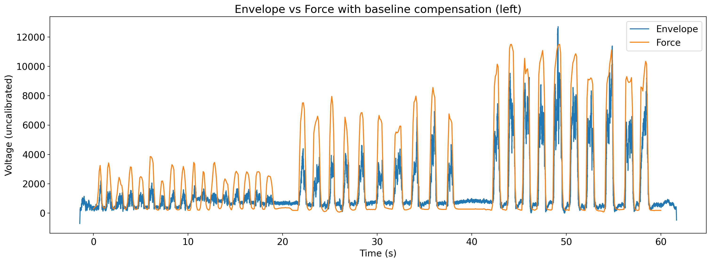
    


```python
baseLine_r=min(interm_r_rms[6000:len(interm_r_rms)-6000])
```


```python
plt.figure(figsize=(18,6))
plt.plot(Time_b,5*(interm_r_rms-baseLine_r),label="Envelope")
plt.plot(f_time[:len(f_interm_r)],max(interm_r_env2-baseLine_r)*f_interm_r/max(f_interm_r),label="Force")
plt.legend()
#plt.xlim(20,30)
plt.title("Envelope vs Force with baseline compensation (right)")
plt.xlabel("Time (s)")
plt.ylabel('Voltage (uncalibrated)')
plt.show()
```


    
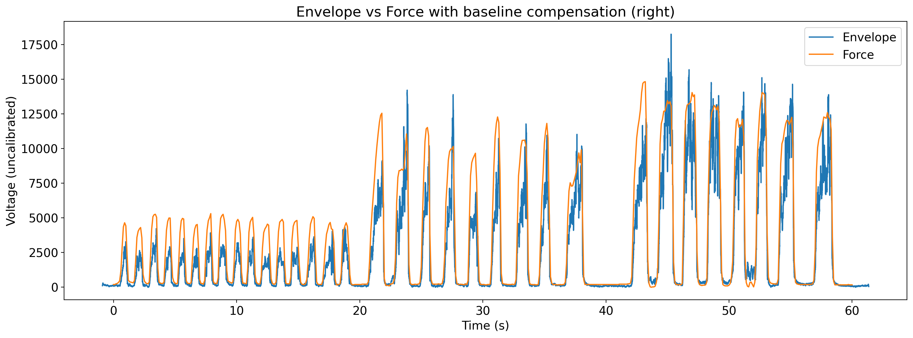
    


Notice that with the MSR method we have borderline effects in the left hand, as well as deformations in the resting periods, which amplifies noise. So, we will use the envelope obtained with method 2: local maxima. Method 2 does not affect the borders of each impulse and helps to keep the amplitude of the signal constant. Despite the fact that the MSR method proved to be less useful in this case, it is very useful when enveloping EEG signals or fatigue EMG signals. It is important to know the limitations of each technique we use, as well as their pros and cons. 

## Impulse amplitude: EMG vs Force


```python
# Define a new array of corrected envelopes
interm_l_c=interm_l_env2-baseLine_l
f_time_l=f_time[:len(f_interm_l)]
interm_r_c=interm_r_env2-baseLine_r
f_time_r=f_time[:len(f_interm_r)]
```


```python
# Segmentation of the EMG envelope by thresholds
segments_l_c=segments_th(time_l_env,interm_l_c,threshold=500)
segments_r_c=segments_th(time_r_env,interm_r_c,threshold=500)
```


```python
# For every segment of the EMG envelope, we append the maximum value to the array interm_l_max
j=0
start=False
interm_l_max=[]
for i in range(0,len(time_l_env)):
    if j==len(segments_l[1][0]):
        break
    if start==True:
        if time_l_env[i]>segments_l[1][0][j]:
            #print(index,i)
            interm_l_max.append(max(interm_l_c[index:i]))
            start=False
            j+=1
    if start==False:
        if j!=37:
            if time_l_env[i]>segments_l[0][0][j]:
                start=True
                index=i
```


```python
# For every segment of the EMG envelope, we append the maximum value to the array interm_r_max
j=0
start=False
interm_r_max=[]
for i in range(0,len(time_r_env)):
    if j==len(segments_l[1][0]):
        break
    if start==True:
        if time_r_env[i]>segments_r[1][0][j]:
            #print(index,i)
            interm_r_max.append(max(interm_r_c[index:i]))
            start=False
            j+=1
    if start==False:
        if j!=33:
            if time_r_env[i]>segments_r[0][0][j]:
                start=True
                index=i
```


```python
plt.figure(figsize=(18,6))
plt.scatter(interm_l_max[:17],f_interm_l_max[:17],label="S1")
plt.scatter(interm_l_max[17:27],f_interm_l_max[17:27],label="S2")
plt.scatter(interm_l_max[27:],f_interm_l_max[27:],label="S3")
plt.legend()
plt.title("Impulse amplitude: EMG vs Force (left)")
plt.xlabel("EMG envelope max")
plt.ylabel("Force max (N)")
plt.show;
```


    
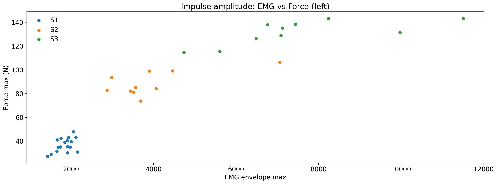
    


```python
plt.figure(figsize=(18,6))
plt.scatter(interm_r_max[:16],f_interm_r_max[:16],label="S1")
plt.scatter(interm_r_max[16:25],f_interm_r_max[16:25],label="S2")
plt.scatter(interm_r_max[25:],f_interm_r_max[25:],label="S3")
plt.legend()
plt.title("Impulse amplitude: EMG vs Force (right)")
plt.xlabel("EMG envelope max")
plt.ylabel("Force max (N)")
plt.show;
plt.show;
```


    
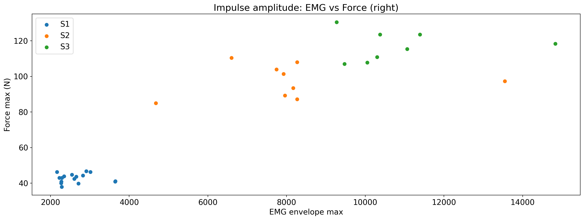
    


## Curve fitting
As can be seen in the previous graphs, the force produced has a logarithmic(ish) response to the amplitude of the signals in the muscles that produced it. So, now we will try to fit a logarithmic function to the curve.


```python
#First we define the log function.
def logarithmic(x,a,b,c):
    return a*np.log(x + b)+c
```

In the previous function we have 3 trainable parameters: a, b and c


```python
# these are the same as the scipy defaults
initialParameters = np.array([1.0, -500.0, -300.0])
```


```python
# curve fit the test data
fittedParameters_l, pcov_l = curve_fit(logarithmic, interm_l_max, f_interm_l_max, initialParameters)
```

    /var/folders/n6/xcj3j4lx6lb8r4wj_86v5cnr0000gn/T/ipykernel_56516/1045232656.py:3: RuntimeWarning: invalid value encountered in log
      return a*np.log(x + b)+c


```python
modelPredictions_l = logarithmic(interm_l_max, *fittedParameters_l) 

absError_l = modelPredictions_l - f_interm_l_max

SE_l = np.square(absError_l) # squared errors
MSE_l = np.mean(SE_l) # mean squared errors
RMSE_l = np.sqrt(MSE_l) # Root Mean Squared Error, RMSE
Rsquared_l = 1.0 - (np.var(absError_l) / np.var(f_interm_l_max))

print('Parameters:', fittedParameters_l)
print('RMSE:', RMSE_l)
print('R-squared:', Rsquared_l)
```

    Parameters: [  54.31161914 -519.81028461 -350.89252246]
    RMSE: 9.372192092606587
    R-squared: 0.9465566888298268


```python
def bubblesort(elements):
    elements2=np.zeros([2,len(elements[0])])
    # Looping from size of array from last index[-1] to index [0]
    cont=0
    for i in range(0,len(elements[0])):
        for j in range(0,len(elements[0])):
            if elements[0,j]==min(elements[0]):
                elements2[:,cont]=elements[:,j]
                elements[0,j]=max(elements[0])+1
                elements[1,j]=0
                cont+=1
                break
                
    return elements2
```


```python
PA_fit_l=np.array([interm_l_max,modelPredictions_l])
```


```python
PA_fit_l=bubblesort(PA_fit_l)
```


```python
plt.figure(figsize=(18,6))
plt.scatter(interm_l_max[:17],f_interm_l_max[:17],label="S1")
plt.scatter(interm_l_max[17:27],f_interm_l_max[17:27],label="S2")
plt.scatter(interm_l_max[27:],f_interm_l_max[27:],label="S3")
plt.plot(PA_fit_l[0],PA_fit_l[1],label="Log fit")
plt.legend()
plt.title("EMG vs Force (left)")
plt.xlabel("EMG envelope max")
plt.ylabel("Force max (N)")
plt.show;
```


    
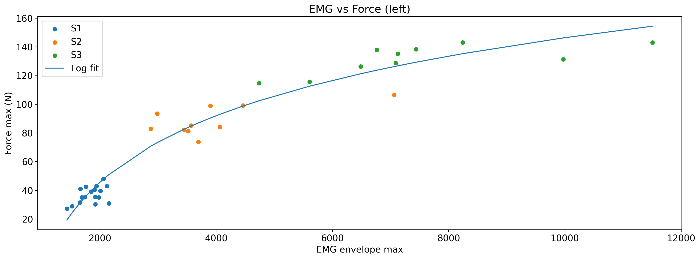
    


```python
# curve fit the test data
fittedParameters_r, pcov_r = curve_fit(logarithmic, interm_r_max, f_interm_r_max, initialParameters)

modelPredictions_r = logarithmic(interm_r_max, *fittedParameters_r) 

absError_r = modelPredictions_r - f_interm_r_max

SE_r = np.square(absError_r) # squared errors
MSE_r = np.mean(SE_r) # mean squared errors
RMSE_r = np.sqrt(MSE_r) # Root Mean Squared Error, RMSE
Rsquared_r = 1.0 - (np.var(absError_r) / np.var(f_interm_r_max))

print('Parameters:', fittedParameters_r)
print('RMSE:', RMSE_r)
print('R-squared:', Rsquared_r)
```

    Parameters: [  47.92615244   21.07684969 -332.47485898]
    RMSE: 10.640590096617057
    R-squared: 0.8976560657623052


```python
PA_fit_r=np.array([interm_r_max,modelPredictions_r])
```


```python
PA_fit_r=bubblesort(PA_fit_r)
```


```python
plt.figure(figsize=(18,6))
plt.scatter(interm_r_max[:17],f_interm_r_max[:17],label="S1")
plt.scatter(interm_r_max[17:27],f_interm_r_max[17:27],label="S2")
plt.scatter(interm_r_max[27:],f_interm_r_max[27:],label="S3")
plt.plot(PA_fit_r[0],PA_fit_r[1],label="Log fit")
plt.legend()
plt.title("EMG vs Force (right)")
plt.xlabel("EMG envelope max")
plt.ylabel("Force max (N)")
plt.show;
```


    
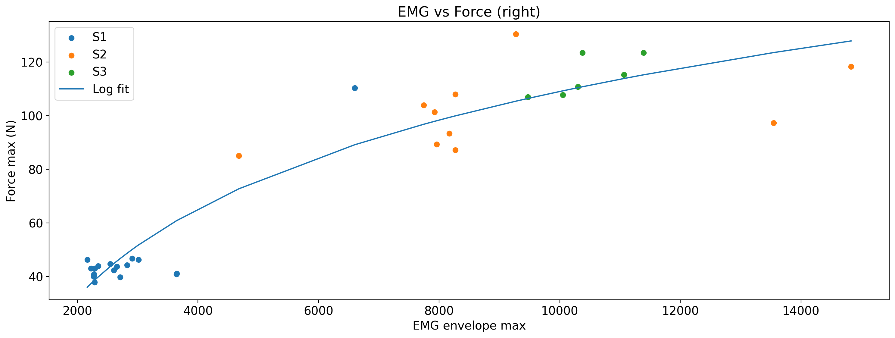
    

